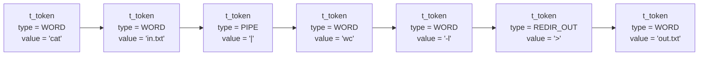
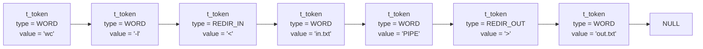

[](https://app.codecrafters.io/users/FirasAguel?r=2qF)

This is a submission to the
["Build Your Own Shell" Challenge](https://app.codecrafters.io/courses/shell/overview).

In this challenge, we are building our own POSIX compliant shell that's capable of
interpreting shell commands, running external programs and builtin commands like
cd, pwd, echo and more.

# Progress 🚀
- [x] REPL
- [x] builtin commands: `exit`, `echo`, `type`, `cd`, `pwd`
- [x] locating executables with PATH and running programs
- [x] lexing into tokens with "qu'ot'in"g and \escaping support
- [ ] parsing
- [ ] redirection
- [ ] piping
- [ ] history

# Architecture

## Lexer & Tokenization
The lexer tokenizes the input line into a linked list using the following structs:
```c
enum e_token_type
{
  WORD,
  PIPE,
  REDIR_IN,
  REDIR_OUT,
  HEREDOC,
  APPEND
};

typedef struct s_token
{
  enum e_token_type type;
  char *value;
  struct s_token *next;
} t_token;

enum e_lexing_modes
{
  MODE_NORMAL,
  MODE_SINGLE_QUOTE,
  MODE_DOUBLE_QUOTE
};

typedef struct s_lexer
{
  enum e_lexing_modes mode;
  t_token *tokens;
  int token_count;
  // TODO use append or ft_realloc
  char buff[1024];
  int buff_i;
  int token_started;
  int escape_flag;
}	t_lexer;
```

### examples
`cat in.txt|wc -l>out.txt`


`wc -l<in.txt 1>out.txt`

